# MARKER: Metadata Templates

```{r echo = F}
library(glossary)
glossary_persistent(path = "glossary/glossary-persistant.yml")
glossary_popup("hover")
```

The [Metadata and Forms](metadata-and-forms.qmd) section showed how STAPLE `r glossary("Forms")` collect metadata while you work on a project. **MARKER** is the companion app for the other half of the job: building, curating, sharing, and citing the metadata *templates* those forms are made from.

If STAPLE is where you *fill in* metadata, MARKER is where you *design and publish* the templates. You can think of it as two things in one:

- **Your private collection** (like a reference manager): the templates you have created, imported, or been invited to work on, including drafts you are still refining.
- **A public archive** (like a data repository): templates that you have published, each frozen with a permanent identifier so that other researchers can find, cite, fork, and reuse them.

MARKER is available at <https://marker.staplescience.com>.

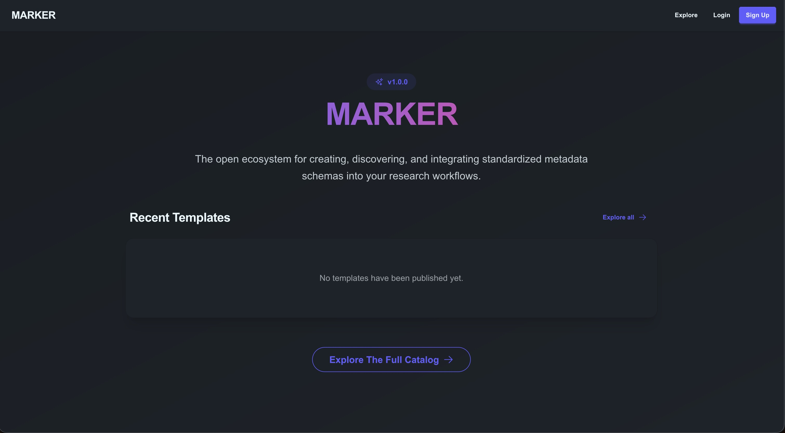

## Signing In

MARKER uses your STAPLE account, so there is nothing separate to set up.

- **Already have a STAPLE account?** Choose **Log in** and use your usual username or email and password.
- **New to STAPLE?** Choose **Sign up**. Creating an account in MARKER also creates your STAPLE account, so you do not need to register twice.

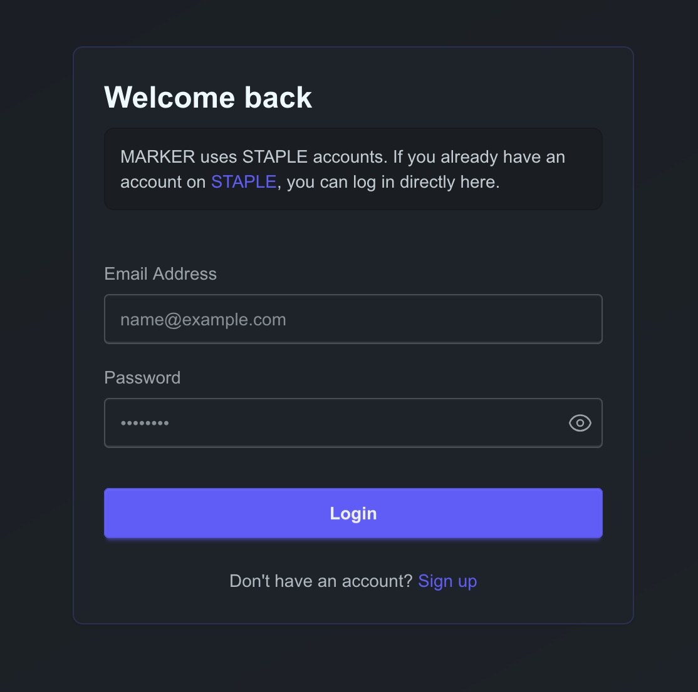

You can browse and search the public archive (the **Explore** page) without an account. You need to be signed in to create, import, edit, or publish templates.

### Completing Your Profile

Open **Profile** from the account menu in the top navigation bar to edit your name, institution, ORCID iD, preferred language, and theme (light or dark). Your **first name, last name, and ORCID iD** are used to pre-fill the contributor list when you publish a template, so it is worth completing them before you publish.

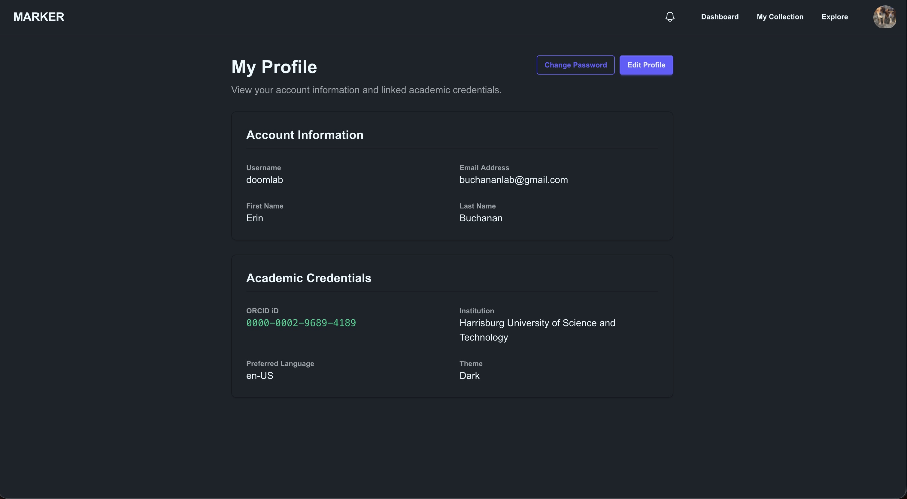

## Finding Your Way Around

Once signed in, the top navigation bar has three main areas:

| Area | What it is for |
|------------------------------------|------------------------------------|
| **Dashboard** | A quick overview of your collection (including your published and archived schemas), plus recent activity and notifications. |
| **Collection** | Your workspace: every template you own or share with others, where you create, edit, and publish. |
| **Explore** | The public archive: search and reuse templates published by anyone. |

The bell icon shows your notifications (see [Collaborating with Others](#collaborating-with-others)).

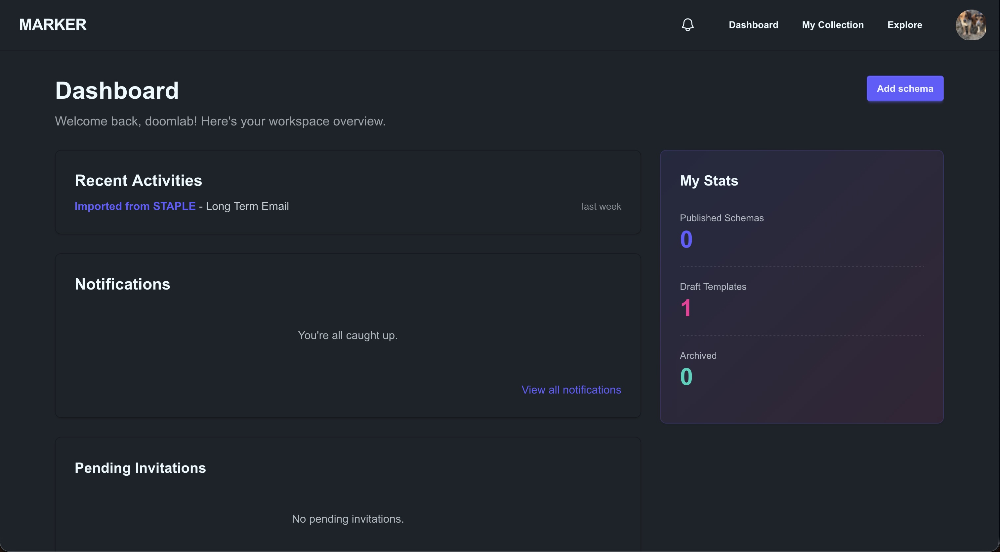

## Your Collection

The **My Collection** page lists your templates in four tabs:

- **Owned**: templates you created or imported.
- **Shared with me**: templates other people have invited you to collaborate on.
- **Archived**: templates you have set aside (see [Archiving and Deleting](#archiving-and-deleting)).
- **Published**: templates you have published to the public archive.

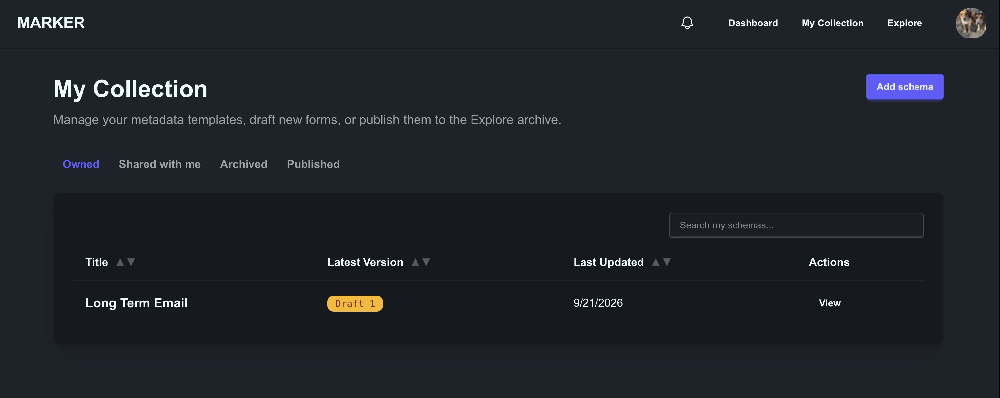

## Creating a Template

Choose the add button on the **My Collection** page to see the ways to start a new template. There are two:

- **Blank draft**: start from scratch in MARKER's form builder.
- **From STAPLE**: bring in a form you have already built in STAPLE.

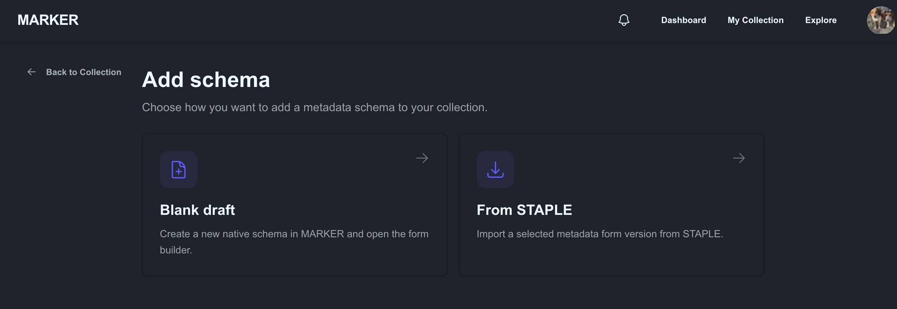

### Starting from a Blank Draft

1.  Choose **Blank draft**.
2.  Give the template a name and create it. MARKER opens the form builder so you can start adding fields.

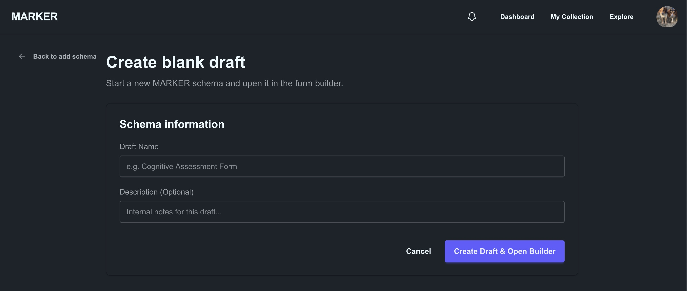

### Importing from STAPLE

If you have already built a form in STAPLE, you can copy it into MARKER rather than rebuilding it.

1.  Choose **From STAPLE**. MARKER lists the STAPLE forms you own.
2.  Select the form and the version you want, then confirm the import.

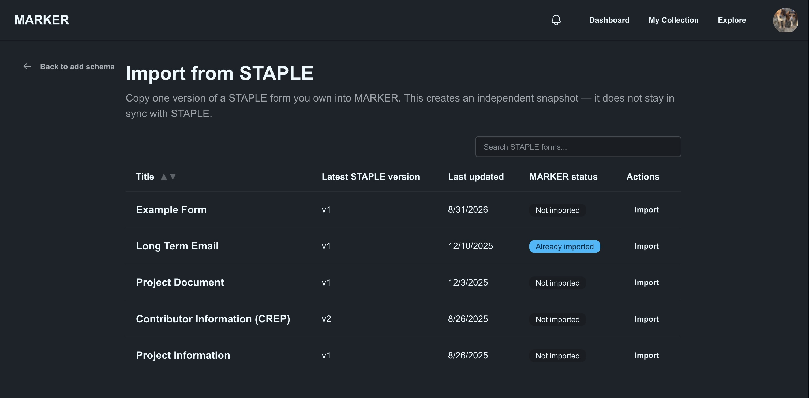

The import creates an **independent snapshot**: a copy of one version of the form. It does not stay linked to the original, so changing the template in MARKER never changes your STAPLE form, and vice versa.

Imported templates are labelled so you can tell where they came from:

- **Imported**: the template is unchanged from the STAPLE version you imported.
- **Based on import**: you have changed the template since importing it.

If you later update the form in STAPLE, open the imported template and use the **Update from STAPLE** option to pull in the newer version. MARKER asks you to confirm before overwriting any local changes you have made, and it keeps the publication details you have already filled in.

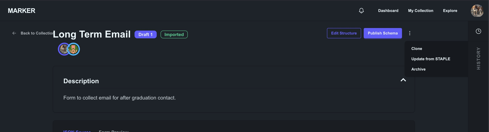

### Cloning a Template

On any template's page, **Clone** makes a fully independent copy of the current version, with its own identity and history. Use this to start a variation of a template you already have.

## Editing a Template

Open a template from your collection and choose **Edit Structure** to open the editor. It works like the STAPLE form builder: you add fields, set their types and labels, and preview the finished form as someone filling it in would see it. Refer to [Building a Form](metadata-and-forms.qmd#building-a-form) for how the builder itself works.

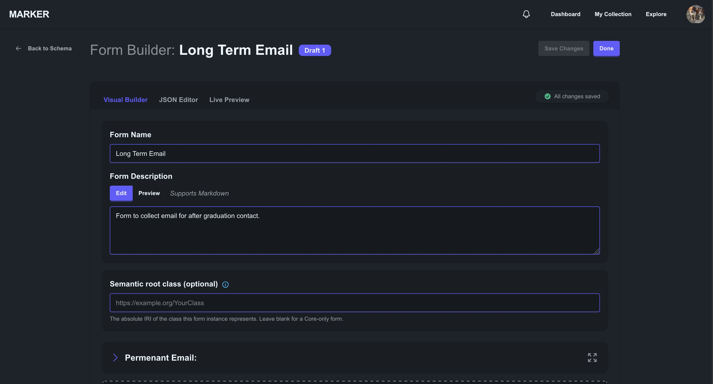

Two things worth knowing:

- **Your work is protected.** MARKER keeps an unsaved-changes safeguard and asks before you leave the editor with edits that have not been saved.
- **Semantic bindings are optional.** In addition to the fields themselves, the editor lets you attach machine-readable meaning (for example, a link to a term in a standard vocabulary) to individual fields. This is optional; a template without it is still valid and publishable. See the [specification](https://staplescience.com/profiles/marker-template/semantic/v1) for the details.

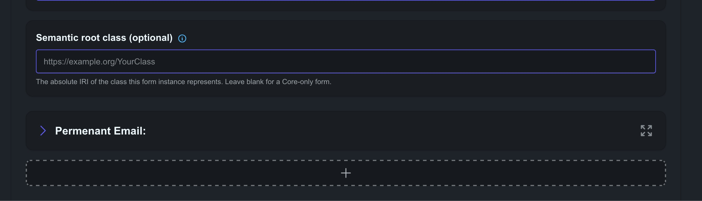

### Versions and History

Every template keeps a version history, shown in the sidebar of its page.

- Drafts are numbered (**Draft 1**, **Draft 2**, ...). Published versions carry their release number (for example **v1.0.0**).
- **New draft version** copies the latest version so you can keep editing. Use it after publishing, since published versions are frozen.
- You can compare two versions side by side to see exactly what changed.
- **Restore** brings an older version back as a new draft. It never rewrites history: the old version stays exactly as it was.
- An unpublished draft can be deleted, unless it is the only version the template has.

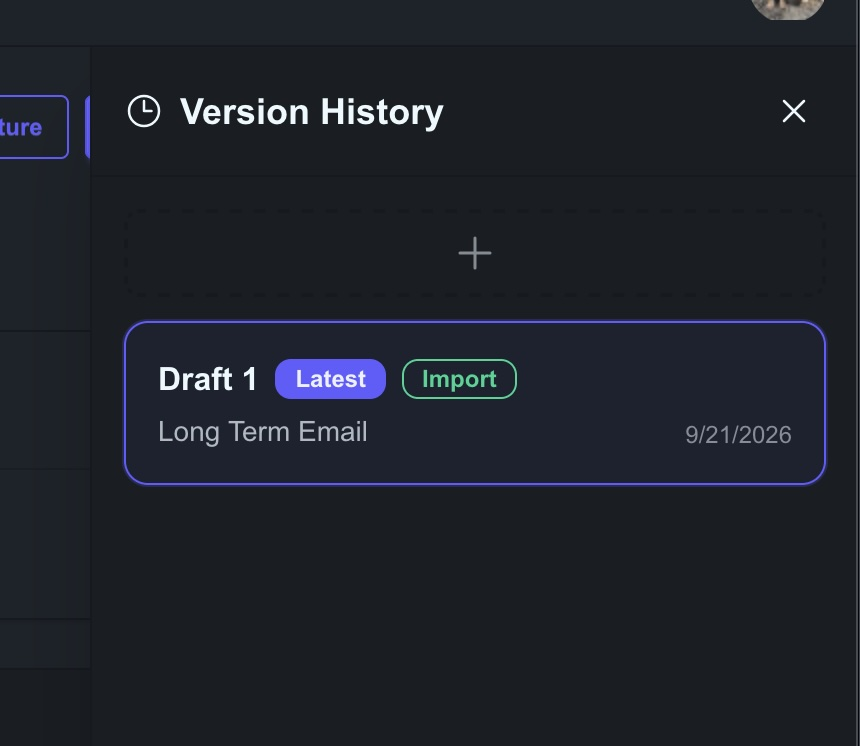

## Publishing a Template

Publishing adds a template to the public archive so that other researchers can find and reuse it. Because published templates are meant to be cited, **publishing is permanent**: a published version is frozen, and it cannot be edited or deleted. Changes go into a new version.

Open the template and choose **Publish Schema**. A three-step wizard guides you through it.

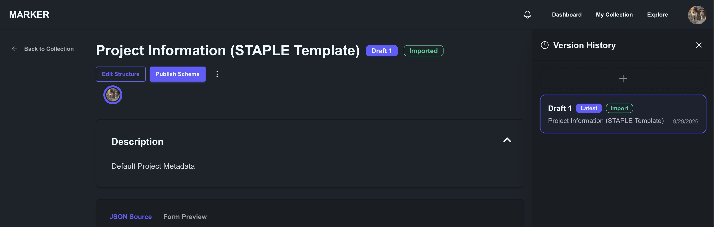

::: callout-note
If your template does not meet the publishing requirements, MARKER shows a **Can't publish yet** page explaining what needs to change instead of opening the wizard. Fix the issue in the editor (**Go to Schema Editor**) and try again.
:::

### Step 1: Core FAIR Metadata

Describe the template so others can discover it. This is what makes it `r glossary("FAIR")`.

- **Domain / Discipline**: for example Psychology, Neuroscience, Economics, or Sociology.
- **Primary Language**: for example English (US), English (UK), Spanish, French, or German.
- **License**: Creative Commons Attribution 4.0 (CC-BY-4.0), CC0 1.0 (public domain), or MIT. An open license is required for publication.
- **Keywords**: type a keyword and press Enter, comma, or semicolon to add it. Keywords are required, because they are how people find your template.

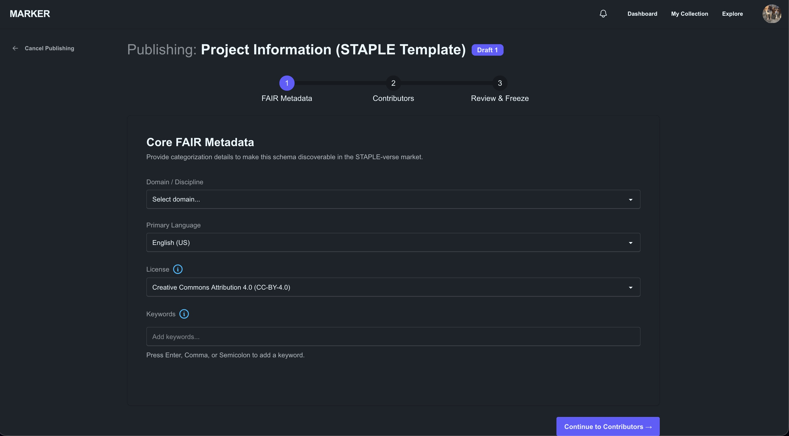

### Step 2: Contributors

List the people who should be credited. At least one contributor is required. MARKER starts the list with you, using the name, ORCID iD, and institution from your profile (this is why completing your profile first helps). For each contributor you can record a role: **Author**, **Creator**, **Maintainer**, **Translator**, or **Data Curator**.

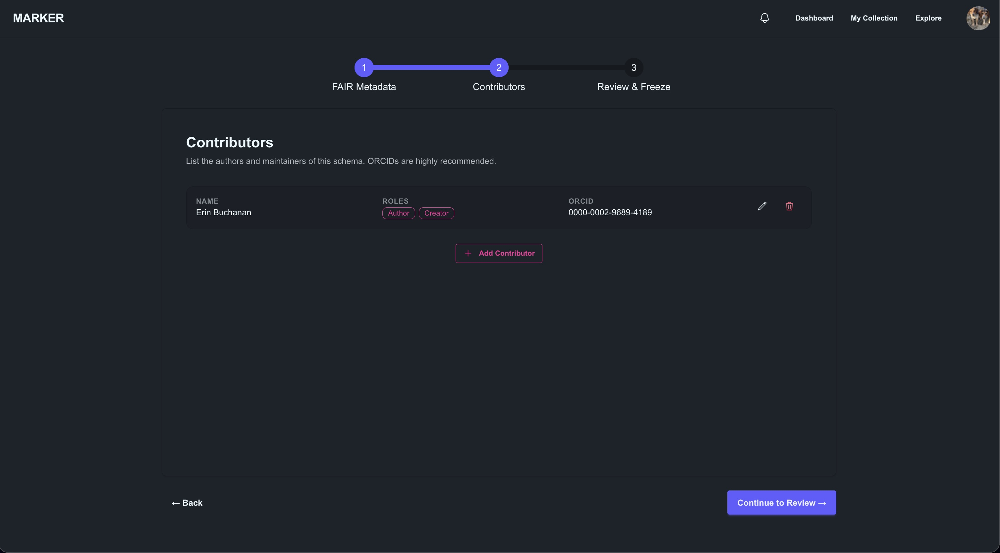

### Step 3: Review and Freeze

Finish the release and publish it.

- **Semantic Release Version**: use the Major.Minor.Patch format (for example `1.0.0`). MARKER suggests the next number and warns you if the version has already been used for this template.
- **Description**: a longer description for researchers deciding whether to reuse your template. This is different from the form's own description, which is shown to people filling it in.
- **Release Notes** (optional): what is new or changed in this version.
- **Related Publication DOI** (optional): link the template to a paper or dataset to strengthen its provenance.

When you publish, MARKER mints a permanent identifier (PID) for the template and freezes the version.

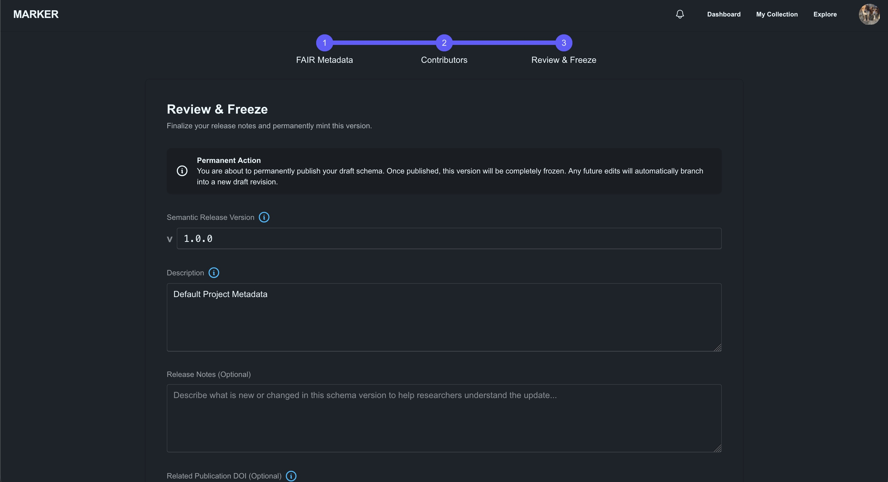

After publishing, the template's page offers **View Public URL**, which opens the public page other people will see.

### Publishing a New Version

To release an updated template, choose **New draft version**, make your changes, and publish again with a higher version number. Each published version stays available under the same template family, so older citations keep working.

## Exploring Published Templates

The **Explore** page is open to everyone. Use the search box to look through titles, descriptions, contributors, and keywords, and narrow the results with the filters:

- **Domain**, **License**, **Language**, and **Source**
- **After** and **Before**, to limit results by publication date

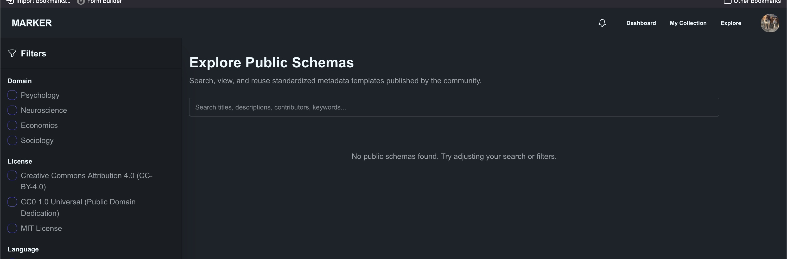

Select a template to open its public page. Here you can read the description, see the contributors and license, browse other published versions, and preview the form. **Export JSON** downloads the template as a machine-readable file.

### Forking a Template

To build on someone else's template, choose **Fork This Schema**. MARKER copies the published template into your own collection as a new draft, and records where it came from, so the lineage is traceable. You can then change it freely and publish your own version. If you have already forked it, the button changes to **View Your Draft**. The original author is notified when someone forks their template.

## Collaborating with Others {#collaborating-with-others}

You can share a template you own with other MARKER users. Click on your icon on the template page to open the contributors view.

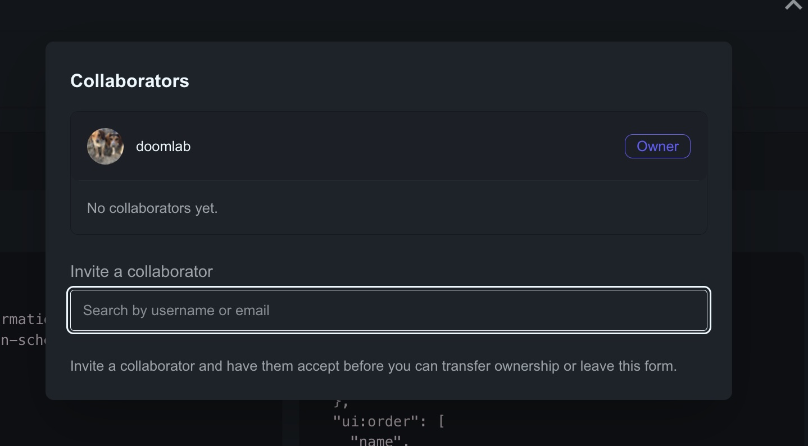

| Role | Can do |
|------------------------------------|------------------------------------|
| **Owner** | Everything, including managing collaborators, archiving, deleting drafts, and transferring ownership. Each template has one owner. |
| **Editor** | Edit the template and its publication details. |
| **Viewer** | View the template, but not change it. |

The invited person sees a banner, **You've been invited to collaborate**, and can accept or decline. Until they accept, they do not have access. The template then appears in their **Shared with me** tab.

Owners can change a collaborator's role, remove a collaborator, or **transfer ownership** to another collaborator (choosing what role they themselves keep afterwards).

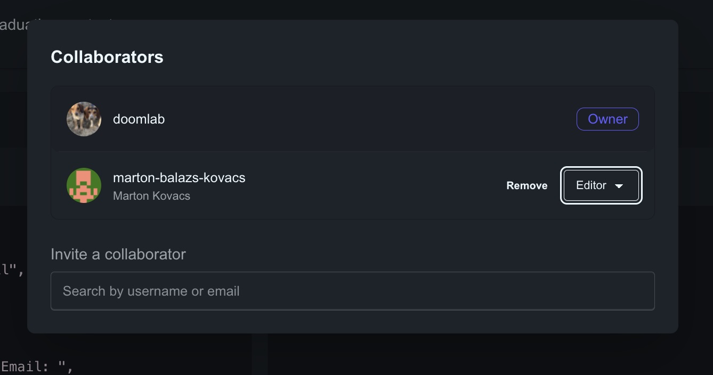

### Notifications

The bell icon in the navigation bar, and the **Notifications** page, tell you when something happens that involves you, such as being invited to a template, being removed from one, ownership being transferred to you, a template being archived, or someone forking one of your published templates.

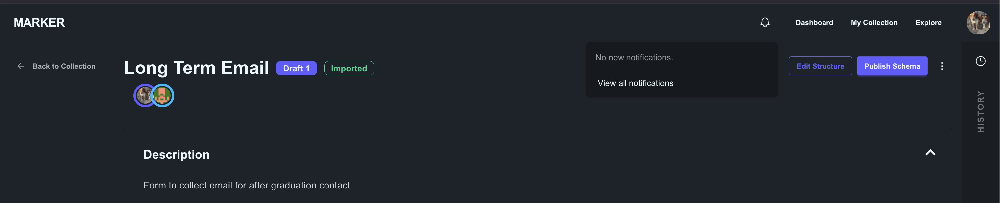

## Archiving and Deleting {#archiving-and-deleting}

MARKER protects published work while letting you discard drafts freely.

- **Archive** (recoverable). The owner can archive any template. It disappears from your active collection, and collaborators no longer see it (they are notified). Archived templates cannot be edited or published. Published versions stay in the public archive and keep resolving at their public URL. Open the **Archived** tab and use **Recover** to bring a template back.
- **Permanently Delete** (not recoverable). Only available for an *archived* template that was **never published**. This removes it completely.
- **Published templates are never deleted.** Once a template has been published, its public record must remain so that citations keep working. Archiving is as far as you can go for the private workspace copy.

## Working Together with STAPLE

MARKER and STAPLE are designed to complement each other.

|   | **STAPLE** | **MARKER** |
|------------------------|------------------------|------------------------|
| **Purpose** | Everyday project management | Curating, sharing, and citing metadata templates |
| **Forms are** | Task checklists and data collection instruments used in projects | Reusable templates intended for publication |
| **Typical use** | Fill in metadata as you work | Design, version, and publish the template itself |

A typical workflow looks like this:

1.  Build and try out a form in STAPLE on a real project.
2.  Import it into MARKER with **From STAPLE**.
3.  Refine it, add semantic bindings if you wish, and invite collaborators to review it.
4.  Publish it so that other researchers can find, cite, and reuse it.

Because MARKER copies rather than links, nothing you do in MARKER changes your STAPLE projects.

## Getting Help

If something is not working, or you have a suggestion, email [staple.helpdesk\@gmail.com](mailto:staple.helpdesk@gmail.com).
