# Metadata and Forms

```{r echo = F}
library(glossary)
glossary_persistent(path = "glossary/glossary-persistant.yml")
glossary_popup("hover")
```

The [Core Concepts](core-concepts.qmd) section introduced `r glossary("metadata")` and `r glossary("Forms")` as two of STAPLE's core elements. This section goes one level deeper: what metadata actually is, why it is worth the extra effort to collect, and the concrete steps for building a form and attaching it to a `r glossary("Task")` so that metadata collection becomes part of your everyday project work.

## What Is Metadata?

Metadata is *data about data* — information that describes a resource rather than being the resource itself. In a research project, "resource" covers more than a final dataset. It can include:

- **Documents**: ethics approvals, stimuli and materials, translations, notes, manuscripts.
- **Data**: primary data you collect (text, audio, video, images) and secondary data you reuse from elsewhere.
- **Code**: analysis scripts, study-implementation code, or software.
- **Project-level information**: the project itself, the people involved, their organizations and funders, and who contributed what.

For example, a dataset's metadata might record its file format, where it can be downloaded, and who created it — without that information being part of the data file itself.

Metadata can be **human-readable** (a descriptive report or a simple table of resources and descriptions) or **machine-readable** (a structured format like JSON that a computer system can parse and index). STAPLE's Forms produce both: a form you fill out in the app *and* a structured JSON record behind the scenes that can be exported and shared.

## Why Metadata Matters

Metadata is often the difference between a resource that can be reused and one that quietly becomes unusable once the people who made it move on. The `r glossary("FAIR")` principles describe what good metadata makes possible [@wilkinson2016]:

- **Findable**: resources can be discovered through databases, search engines, and repositories.
- **Accessible**: others know how to obtain or use the resource.
- **Interoperable**: the resource can be combined with other resources and tools.
- **Reusable**: enough context is provided that someone else (including future-you) can reuse it correctly.

Beyond FAIR, there are practical reasons to collect metadata as you go rather than after the fact:

- **It's increasingly required.** Journals adopting the `r glossary("Transparency and Openness")` guidelines, and funders with open-data mandates, expect metadata alongside shared resources [@grant].
- **It supports reproducibility.** Collaborators and reviewers can independently verify and correct your work when the context behind it is documented.
- **It enables reuse and extension.** Well-described resources can be combined, reanalyzed, or extended in ways the original authors didn't anticipate.
- **It's easy to lose track of later.** Details like instrument settings, consent versions, or who approved what are hardest to reconstruct after the project has ended, which is exactly when they're usually asked for.

STAPLE tries to make metadata collection cheap by attaching it to work you're already doing, rather than treating it as a separate write-up at the end of a project.

## Forms: How STAPLE Collects Metadata

In STAPLE, `r glossary("Forms")` are the structured templates used to collect metadata. A form defines *what* information should be collected (its schema) and *how* it is displayed to the person filling it out (its layout). Forms are built independently of any one project, saved to your account, and then reused across as many projects and tasks as you like.

STAPLE includes a library of `r glossary("Form Template")`s covering common needs (e.g., ethics approvals, dataset descriptions) so you have a starting point even if you've never designed a metadata schema before. You can also build a form entirely from scratch.

## Building a Form

Forms are created and edited on the main **Forms** page (from the main dashboard navigation), not inside a specific project — this is what lets the same form be reused across projects.

- Go to the **Forms** page and click **Create New Form** (or **Add Form Templates** to start from an existing template instead of a blank form).

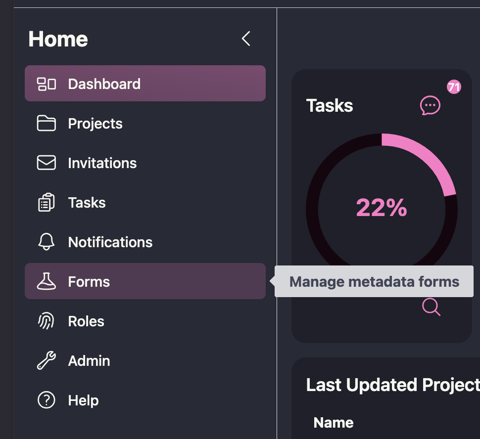


- This opens the form builder, which has three working views:

  - **Visual Builder**: add fields (text, numbers, dates, choices, etc.) and configure their labels, descriptions, and requirements without writing JSON by hand.
  - **JSON Builder**: edit the underlying JSON Schema and UI Schema directly, useful if you're importing an existing schema or want finer control.
  - **Preview**: see the form exactly as a contributor filling it out would.

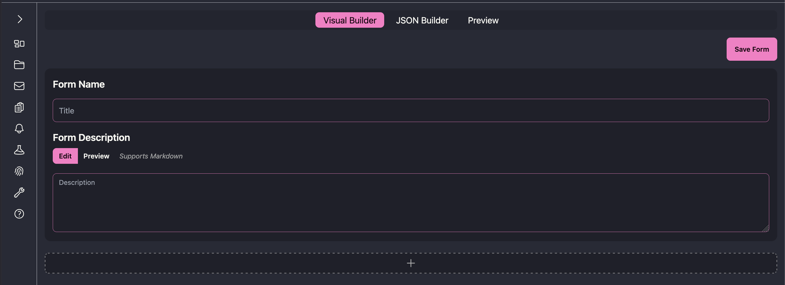

- Before adding any fields, fill in the **Form Name** and **Form Description** at the top of the Visual Builder. The description supports Markdown and appears as help text at the top of the form, so contributors see it before they start filling anything in.

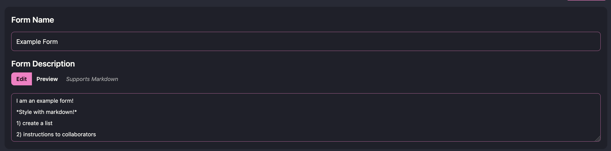

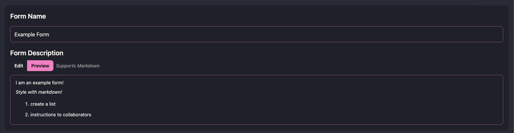

- Click the **+** below the description to add your first item. Choosing **Item** opens a new field card; choosing **Section** creates a labeled group you can add items into (useful for organizing a long form, e.g., separating "Ethics" fields from "Data" fields).

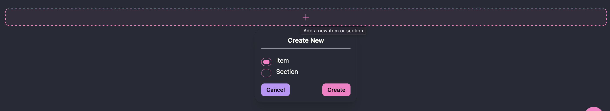

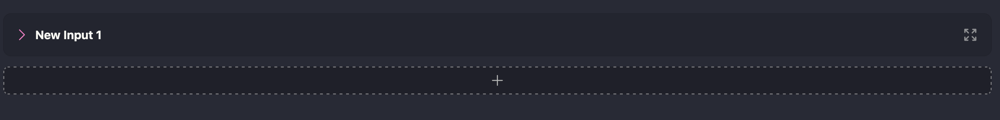

- Every item needs its own information filled in before it's meaningful — the item is created blank, so you fill in:

  - **Variable Name**: the key used when the data is exported (e.g., in the downloaded JSON).
  - **Display Name**: the label shown on the form itself.
  - **Description**: help text shown under the field to the person filling it out.
  - **Item Type**: what kind of input this is (see [Item Types](#item-types-and-rules) below).
  - **Ontology ID** (optional): binds the field to a standard vocabulary code (e.g., `NCIT:C25150`) to improve findability if your field maps onto an existing standard.

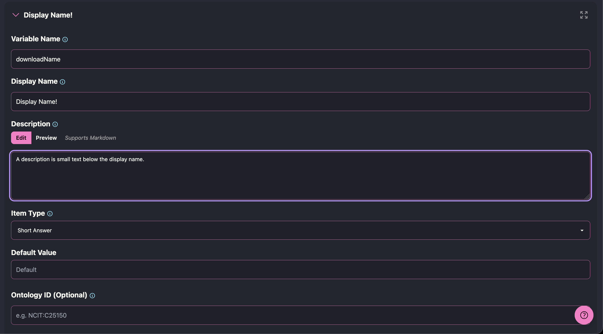

- You can also toggle **Required** at the bottom of the card, and use the pencil icon to open additional, type-specific settings (validation rules, default values, and dependencies — covered below). The trash icon deletes the item, and the arrows icon lets you drag it to reorder items or move them between sections.

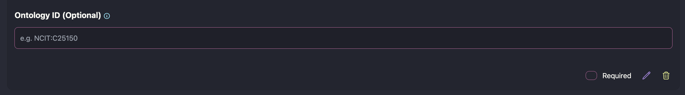

- Click **Save Form**. Once saved, the form gains an **Information** tab where you can:
  - Add **tags** and assign it to a **folder** to keep your form library organized.
  - View its `r glossary("Form Version")`s — every save creates a new version, and earlier versions stay available for tasks that already used them, so editing a form does not silently change data already collected under an older version.

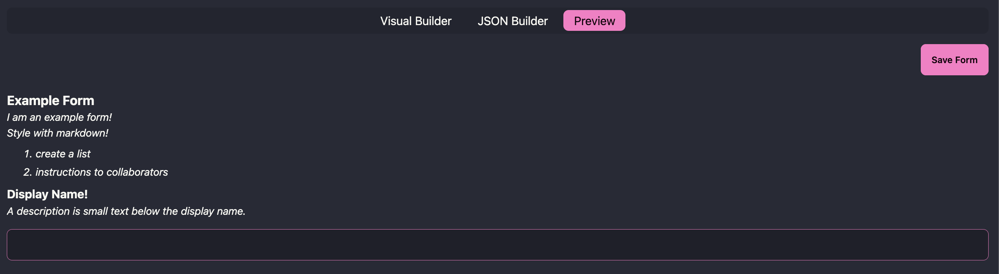

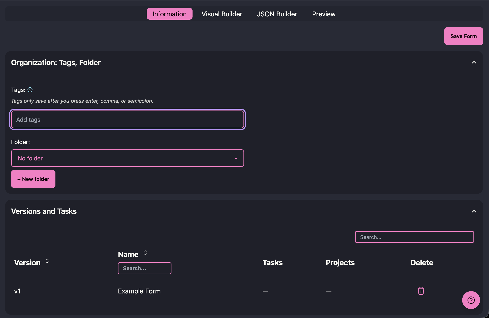

A form only needs to be built once. From here on, it's a reusable asset you attach to tasks whenever you need to collect that kind of metadata.

## Item Types and Rules {#item-types-and-rules}

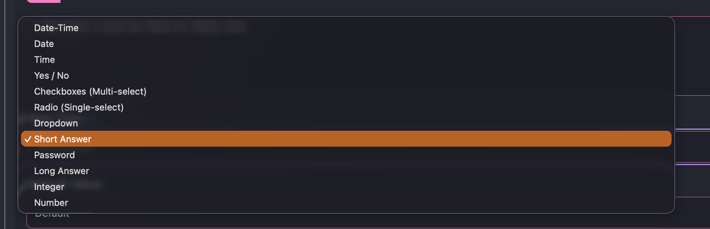

Each item you add to a form has an **Item Type**, which determines what kind of input the contributor sees and what the value looks like when the form data is exported. The Visual Builder currently supports:

- **Short Answer**: a single line of text. Its settings (via the pencil icon) let you set minimum/maximum length, a regular expression pattern the input must match, a common format (email, hostname, URI, or a custom regular expression), a browser autocomplete category, and a placeholder.
- **Password**: a masked short-answer field, useful for entering credentials that shouldn't be shown on screen.
- **Long Answer**: a multi-line text box, with the same length/pattern settings as Short Answer.
- **Integer** and **Number**: numeric input, with settings for a required multiple (e.g., must be a multiple of 5), and a minimum/maximum (each of which can be marked *exclusive*, i.e., the value must be strictly greater/less than the bound rather than equal to it).
- **Date**, **Time**, and **Date-Time**: date and/or time pickers.
- **Yes / No**: a checkbox for boolean (true/false) values.
- **Radio (Single-select)** and **Dropdown**: choose one value from a list you define. You can give each stored value a different display label, and force the list to store numbers instead of text.
- **Checkboxes (Multi-select)**: choose any number of values from a list you define, stored as an array.
- **Reference**: reuse a field definition you've already created elsewhere in the same form, so you don't have to redefine the same structure twice.

Every item can also be marked **Required**, which prevents the form from being submitted until that item has a value.

### Dependencies

Any item can control whether *other* items on the form are shown, using the **Dependencies** setting (in the pencil-icon settings for that item). This lets you build forms that only ask follow-up questions when they're relevant, instead of showing every field to every contributor. There are two modes:

- **Any value**: the dependent item(s) appear as soon as the controlling item has *any* answer.
- **Specific value**: the dependent item(s) appear only when the controlling item is set to a particular value (or one of a set of values) that you choose.

You can add multiple dependency relations to the same item, and a dependent item shows a "Depends on \_\_\_" indicator in the builder so it's clear which items are conditional. For example, a Yes/No item "Did this study collect human data?" could be set so that answering "Yes" reveals a Short Answer item for "IRB/Ethics approval number," which stays hidden for studies that don't need it.

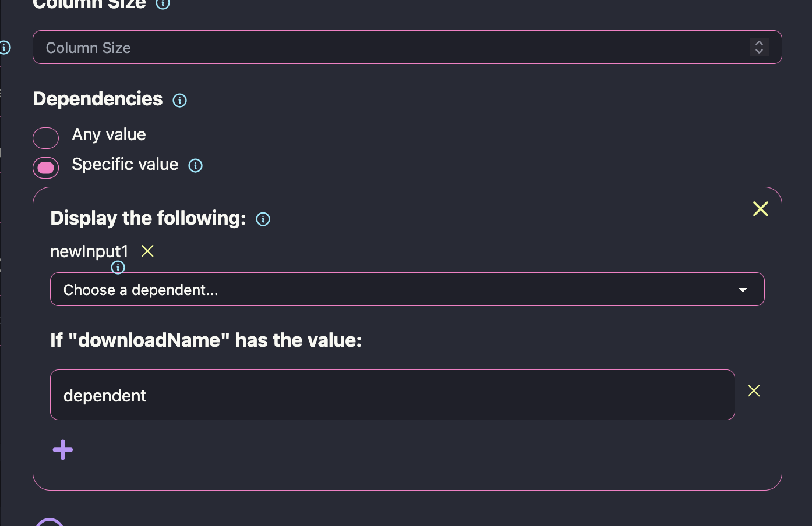

## Using a Form in a Task

Once a form exists, it can be required as part of completing a `r glossary("Task")`:

1.  In a project, create a new task or edit an existing one.
2.  Open the **Details: Instructions, Dates, Forms, Roles** section of the task form.
3.  Click **Assign Form**. This opens a list of the available forms (with their version, creator, and creation date) — select the one the task should require, then confirm.
4.  Save the task as usual. The assigned contributor or team now sees this form as part of the task.

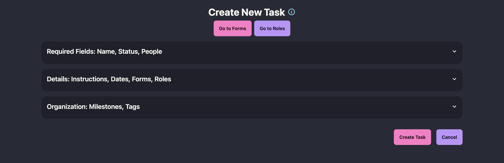

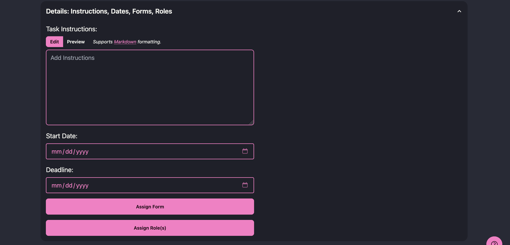

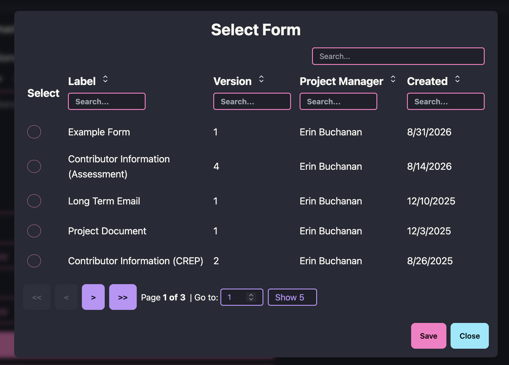

When a contributor works on the task, the assigned form appears as part of completing it. They fill in the requested fields and submit; STAPLE stores the submitted values as that task's metadata and time-stamps the submission alongside the rest of the `r glossary("Task Logs")` history. If a mistake is made, the form can be reopened and resubmitted, and the previous entry is replaced.

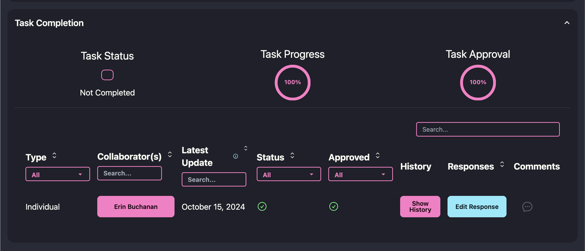

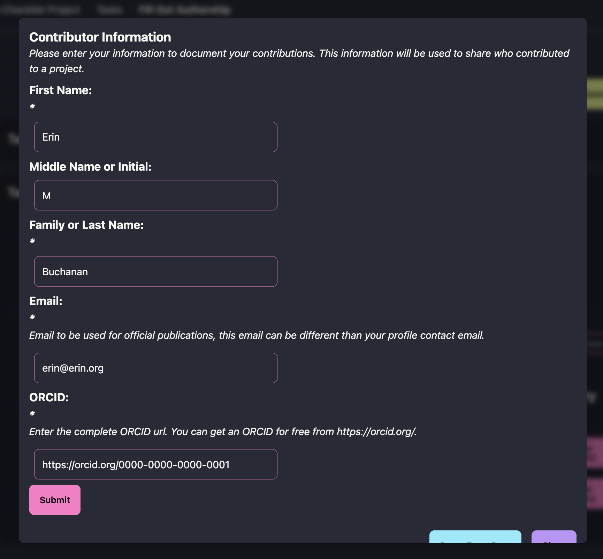

*Note*: once a contributor has started completing a task, **both the task and its form are locked** — you can no longer change which form is assigned to that task, since that would alter the schema against which data has already been collected. If the form itself needs to change, edit it anyway: saving your changes doesn't overwrite the version already in use, it creates a new `r glossary("Form Version")`. The in-progress task keeps its original, locked version and whatever data has already been collected under it, while the new version becomes immediately available to assign to any task — including a new task if this one needs to move to the updated version.

## Where Form Data Lives Afterward

Metadata collected through forms doesn't disappear into the task it was attached to. At the project level, the `r glossary("Form Data")` page gives a centralized, exportable view of every completed form across the project, and the **Summary** page rolls metadata, contributors, tasks, and outputs together into a shareable `r glossary("Project Summary")` — available as both a machine-readable JSON export and a human-readable report. This is what makes the metadata you collect along the way reusable later, by your collaborators, by journals and funders, or by your own future self.

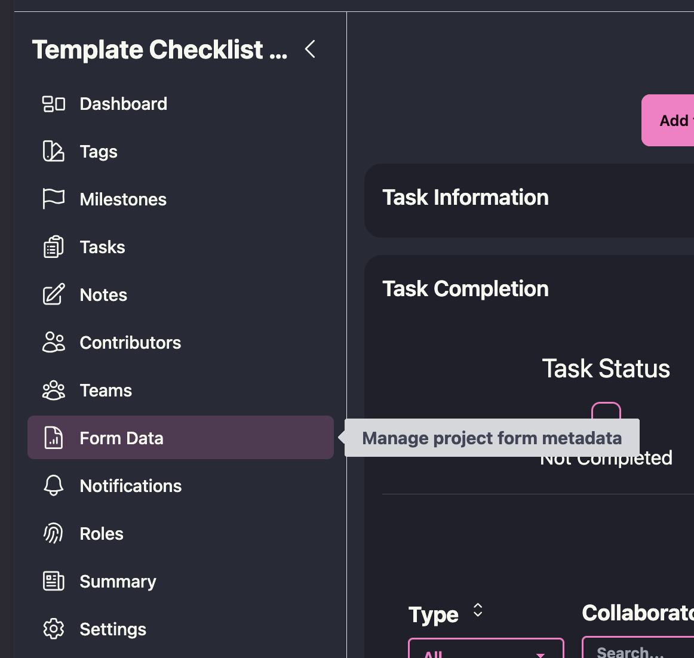

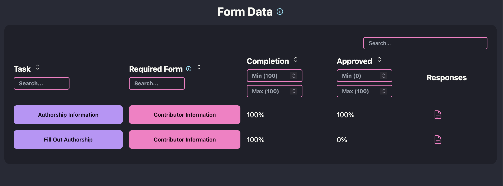

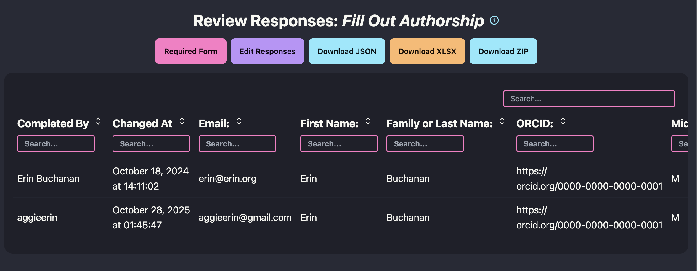
